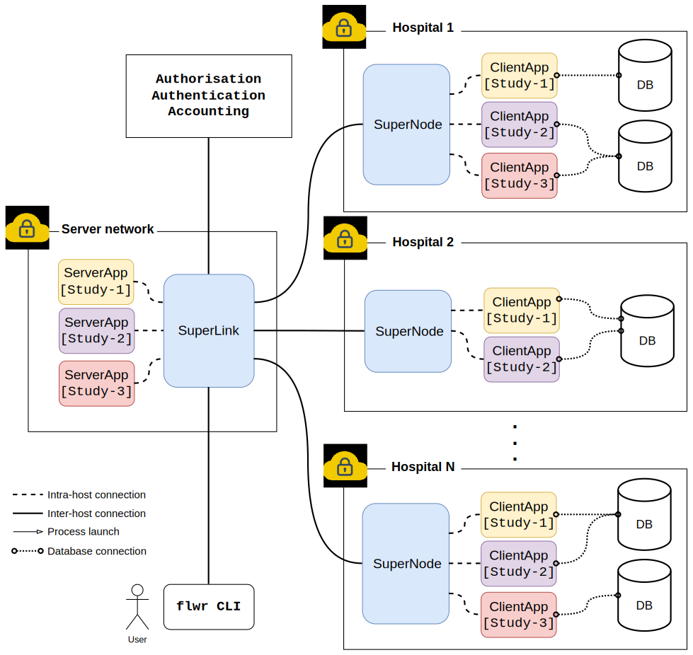

# FLAAA

This repository contains example code and helper packages for federated
learning experiments and access-control integrations used by the FLAAA project.

Overview
--------

- `examples/` — Flower-based example apps (see [examples/README.md](examples/README.md)).
- `aggregation-strategies/` — Reusable aggregation strategy implementations
  (`FedAvgGridWithFilter`, `FedMAPWithFilter`) documented in
  [aggregation-strategies/README.md](aggregation-strategies/README.md).
- `pdp/` — A small Policy Decision Point (PDP) playground and related tooling
  (see `/pdp/README.md`).
- `superlink/` — SuperLink integration and examples (see `/superlink/README.md`).

Purpose
-------

This repo demonstrates:

- How to run Flower `ServerApp` and `ClientApp` examples with access-control
  hooks (PEP/PDP) and custom Grid aggregation strategies.
- How to use and extend aggregation strategies provided in
  `aggregation-strategies/` from multiple projects.

Quick start (examples)
----------------------

1. Install the example package dependencies (from the `examples/` directory):

```bash
cd examples
pip install -e .
```

2. Run the included example (simulation runtime):

```bash
flwr run .
```

Docker
------

A `docker-compose.yml` is provided at the repository root that starts a
GPU-enabled container named `pytorch-gpu` (container name `flaaa`). The
service mounts the repository at `/workspace` so you can run examples from
inside the container.

Requirements:

- Docker installed on the host
- NVIDIA drivers and the NVIDIA Container Toolkit if you intend to use the GPU

Common commands:

```bash
# Start in foreground (build if needed)
docker compose up --build

# Start in background
docker compose up -d

# Open an interactive shell inside the service
docker compose run --rm pytorch-gpu bash
```

If you don't have GPUs available, run the examples locally in your Python
environment or modify `docker-compose.yml` to use a non-GPU image.


Further reading
---------------

- Example app details: [examples/README.md](examples/README.md)
- Aggregation strategies: [aggregation-strategies/README.md](aggregation-strategies/README.md)
- PDP tooling: [pdp/README.md](pdp/README.md)
- SuperLink integration: [superlink/README.md](superlink/README.md)


Background
----------

FLA^3 (Federated Learning with Authentication, Authorization and Accounting)
is a governance-aware platform for privacy-preserving, multi-centre healthcare
research. It addresses practical and regulatory challenges that arise when
collaborating across institutions and jurisdictions by treating enforceable
governance controls as first-class system properties integrated into the
federated learning orchestration layer.

Key problems addressed:

- Cross-jurisdictional regulatory compliance (GDPR, HIPAA, DPDPA, ECOWAS).
- Preventing unauthorised participation and unaccountable computation.
- Enforcing time-bounded, study-scoped participation and least-privilege roles.
- Providing tamper-evident audit records for regulatory review.

Technical summary
-----------------

- Architecture: three-layer design comprising a central coordinator (SuperLink),
  site-local gateways (SuperNodes), and short-lived study `ClientApp` processes.
  Communication uses client-initiated gRPC to accommodate egress-only hospital
  network configurations.
- Governance model: runtime policy evaluation (XACML-compatible PDP) enforces
  five derived requirements: R1 (authenticated institutional participation),
  R2 (study-scoped authorisation), R3 (role-based least-privilege),
  R4 (temporal validity), and R5 (accounting and auditability).
- Enforcement: the PDP is queried at key federation lifecycle points (node
  activation, study join, per-round aggregation); decisions are fail-closed and
  recorded as structured audit events. Audit records may be JWS-signed for
  tamper-evidence.
- Aggregation: governance filtering is performed at orchestration time; the
  repository demonstrates integration with FedMAP (personalised FL) but the
  AAA layer is algorithm-agnostic (see `aggregation-strategies/`).

Repository mapping
------------------

- `superlink/` — coordinator and SuperLink examples (see `/superlink/README.md`).
- `examples/` — sample `ServerApp`/`ClientApp` deployments demonstrating how
  to use the platform for a medical demo (see `examples/README.md`).
- `aggregation-strategies/` — reusable aggregation strategies integrated with
  access-control filtering (see `aggregation-strategies/README.md`).
- `pdp/` — PDP implementation and tooling for policy evaluation and auditing
  (see `pdp/README.md`).

Architecture diagram
--------------------



License
-------

This repository is licensed under the Apache License 2.0. For the full
license text, see the Apache website: https://www.apache.org/licenses/LICENSE-2.0

