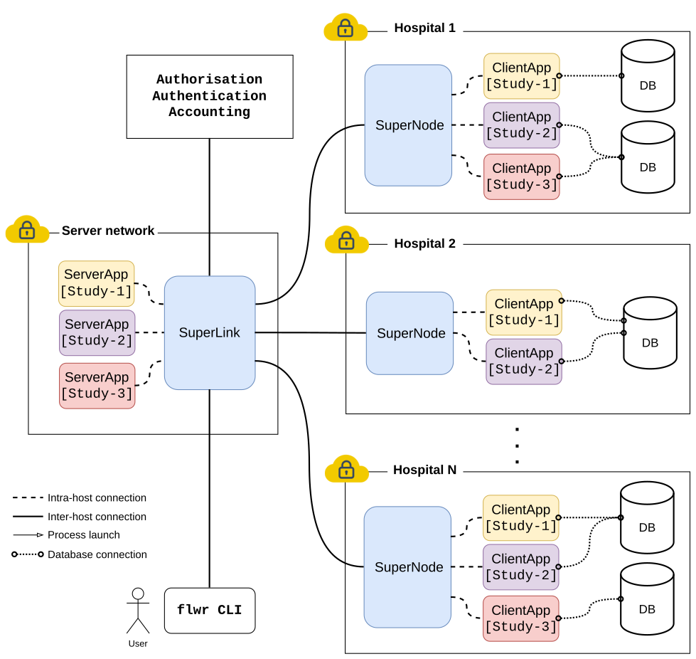

# FLA³

FLA³ integrates authentication, authorisation and accounting into Flower federated learning. Policy enforcement covers study approval, node activation, training, aggregation and evaluation. Each action requires an explicit `Permit` from the XACML policy decision point (PDP); request failures and other decisions deny access. Decisions are checked afresh without cached permits.

The medical application supports FedAvg, FedProx, FedPer and FedMAP. The PDP supports ES256 signatures, a SHA-256 audit chain, periodic signed checkpoints and continuity across process restarts. Policy versions and digests are returned with decisions and recorded in the audit log.

## Components

| Directory | Contents |
| --- | --- |
| [examples](examples/README.md) | Flower ServerApp and ClientApp, centre-level data preparation, synthetic demo and fault injection |
| [aggregation-strategies](aggregation-strategies/README.md) | Installable governance-filtered aggregation strategies |
| [pdp](pdp/README.md) | XACML policies, policy information point, audit writer and verification tools |
| [superlink](superlink/README.md) | Custom Flower Fleet service for study approval |

## Run locally

Use Python 3.11 or later and Node.js 20.9 or later. Install the application with `pip install -e ./examples` and the PDP with `npm ci --prefix pdp`. See the [example instructions](examples/README.md) for a synthetic run and HTTPS PDP configuration.

Patient datasets are supplied separately by authorised operators. No datasets, prepared patient arrays, model files, private keys or audit streams are distributed with this repository. `INTERVAL_DATA_DIR` selects the directory containing prepared centre arrays and metadata.

Before sharing a source snapshot, run:

```bash
python3 scripts/check_public_files.py
```

To export those source files without local datasets or Git history, use:

```bash
python3 scripts/export_source.py /path/outside/repository/FLAAA-source.zip
```

This checks tracked and non-ignored candidate paths. Git ignore rules also exclude datasets and runtime artifacts; application wheels exclude data directories. A source snapshot should contain only the checked source files, without `.git` or ignored local files.

## Governance and accounting

The policy checks study validity, institutional membership, membership expiry and task role. Participants can train and contribute to aggregation; authorised observers can evaluate. Changes to the policy information file are read on subsequent requests. Operators can pin the expected policy version or SHA-256 digest at the PEP.

For signed accounting, set `REQUIRE_ES256_SIGNING=true`, provide a P-256 signing key and configure persistent audit and checkpoint paths. Store checkpoints and public-key history independently of the active audit log. The [combined verifier](pdp/README.md#verify-accounting) checks record signatures, key identifiers, hashes, sequence order and checkpoint anchors.

The audit mechanism detects retained-record modification, deletion and reordering. Trusted checkpoints detect truncation before an anchored position. Events never logged and deletion of a tail beyond the latest checkpoint remain outside that guarantee. Governance controls participation; clinical data remain under each site's control.


